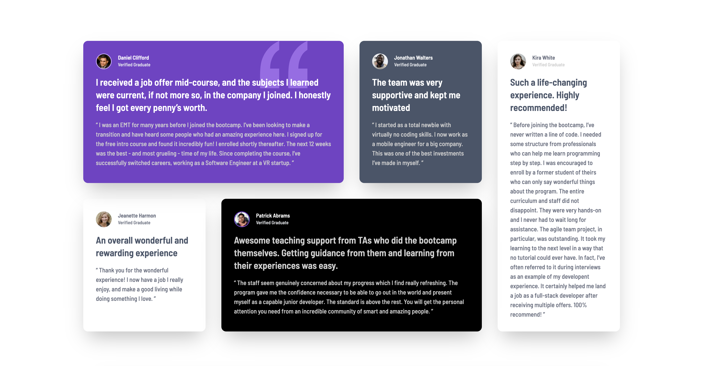

# Frontend Mentor - Testimonials Grid Section

This is my solution to the [Testimonials Grid Section challenge on Frontend Mentor](https://www.frontendmentor.io/challenges/testimonials-grid-section-Nnw6J7Un7).  
It was built using **HTML5** and **CSS3**. The goal was to create a responsive testimonials grid layout that looks great on both desktop and mobile devices.

---

## 🔗 Live Site

👉 [Live preview here](https://umutyavyz.github.io/Frontend-Mentor-Testimonials-Grid-Section/)

---

## 📸 Screenshots

### Desktop Design

### Mobile Design

---

## 🛠️ Technologies Used

- HTML5
- CSS3 (Grid & Flexbox)
- Responsive Design
- Git & GitHub
- [Frontend Mentor](https://www.frontendmentor.io/)

---

## 💡 What I Learned

- Creating complex grid layouts with CSS Grid
- Implementing responsive design with mobile-first approach
- Working with testimonial card components and consistent spacing
- Managing different grid areas for various screen sizes
- Using CSS custom properties for maintaining consistent colors and typography
- Handling profile images and quotation marks in testimonial cards

---

## 🧩 Useful Resources

- [CSS Grid Layout Guide](https://css-tricks.com/snippets/css/complete-guide-grid/)
- [MDN CSS Grid Documentation](https://developer.mozilla.org/en-US/docs/Web/CSS/CSS_Grid_Layout)
- [Frontend Mentor Challenges](https://www.frontendmentor.io/challenges)
- [CSS Grid Garden](https://cssgridgarden.com/) - Interactive CSS Grid learning
- [MDN Responsive Design](https://developer.mozilla.org/en-US/docs/Learn/CSS/CSS_layout/Responsive_Design)

---

## ✍️ Author

- GitHub: [@umutyavyz](https://github.com/umutyavyz)  
- Frontend Mentor: [@umutyavyz](https://www.frontendmentor.io/profile/umutyavyz)  

---

## 📜 License

This project is open source and available under the [MIT License](LICENSE).